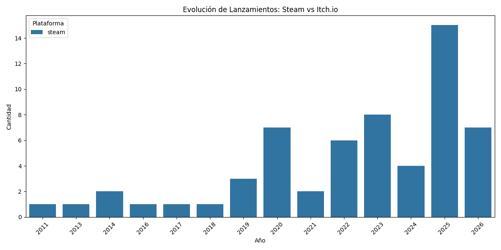

# Dataviz de la Industria de Videojuegos en Chile 🇨🇱🎮

Un análisis profundo del desarrollo de videojuegos en Chile durante el siglo XXI, combinando datos de **Steam** (comercial) e **Itch.io** (indie).

## 🚀 Hallazgos Principales

- **Fuerte Crecimiento Post-2020**: La escena indie explotó en los últimos años, con Itch.io sirviendo como plataforma principal de experimentación.
- **Dos Mundos**:
    - **Steam**: Mercado Premium ($8-10 USD), géneros de Acción y Estrategia.
    - **Itch.io**: Mercado Free/Experimental, gran diversidad creativa.
- **Top Ventas (Estimado)**: *Rock of Ages*, *Tormented Souls* y *Zeno Clash* lideran las estimaciones de revenue.



## 🛠️ Estructura del Proyecto

```
chilean-videogames-analysis/
├── src/
│   ├── collect.py      # Recolección datos Steam
│   ├── collect_itch.py # Recolección datos Itch.io
│   ├── clean.py        # Limpieza y estructuración
│   ├── analyze_all.py  # Generación de insights
│   └── utils.py        # Utilidades compartidas
├── data/
│   ├── raw/            # (Ignorado) Scrape raw
│   └── export/         # CSV enriquecido para Looker/Tableau
└── assets/
    └── figures_v2/     # Gráficos generados
```

## 📊 Dashboard de Datos

Puedes encontrar el dataset enriquecido en `data/export/chilean_games_final.csv`, listo para importar en herramientas como Looker Studio o PowerBI.

## Cómo reproducir

1.  Instalar dependencias: `pip install -r requirements.txt`
2.  Ejecutar recolección: `python src/collect.py`
3.  Procesar y analizar: `python src/analyze_all.py`
